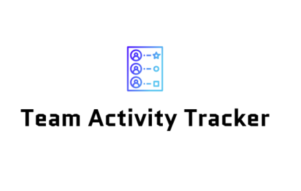
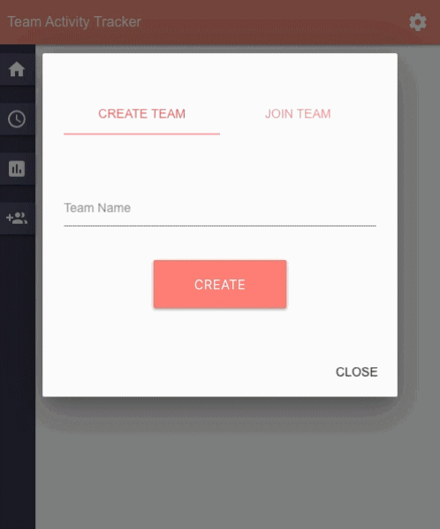
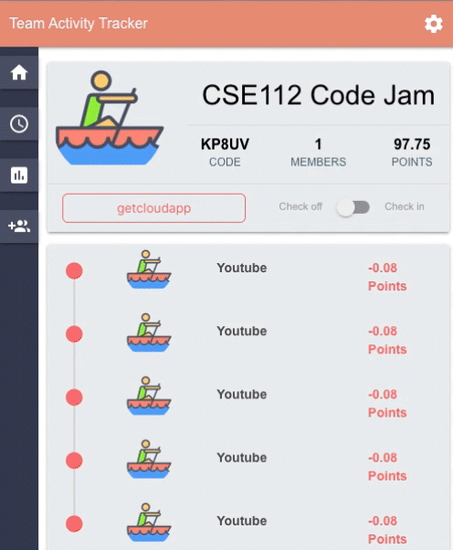

# Team Activity Tracker


[](https://www.codacy.com/gh/cse112-sp20/TEAM-1-CODE-JAM?utm_source=github.com&amp;utm_medium=referral&amp;utm_content=cse112-sp20/TEAM-1-CODE-JAM&amp;utm_campaign=Badge_Grade)

:star: Star us on GitHub — it helps!

<h1 align="center">
  <br>
  
</h1>

<h4 align="center">A Google Chrome Extension Team Activity Tracker based on <a href="https://reactjs.org/" target="_blank">React</a>.</h4>
<p align="center">
  <a href="#about">About</a> •
  <a href="#demo">Demo</a> •
  <a href="#installation">Installation</a> •
  <a href="#Features">Features</a> •
  <a href="#related">Related</a> •
  <a href="#contributing">Contributing</a> •
  <a href="#links">External Links</a> •
  <a href="https://github.com/cse112-sp20/TEAM-1-CODE-JAM/wiki">Wiki</a> •
  <a href="#team">Team</a>
</p>

# About
To promote productivity :rocket:, we introduce [Team Activity Tracker Chrome Extension](https://chrome.google.com/webstore/) to monitor team activity :computer: as a reinforcement for avoiding distractions and procrastination. A chrome extension that installs in less than five minutes :raised_hands:.

With the sudden changes to our everyday lives, remote work is now more prevalent in our everyday lives. Despite holding the same responsibility, remote work proposes new challenges to productivity. The difference in environment can be a huge factor that affects one’s concentration and task management. Working at home opens doors to limitless distractions such as Youtube, Facebook, and other social media platforms that constantly seek our attention. We are in a situation where team accountability is at an all time high when the only thing standing between your teammates is a screen. 

# Demo
👉 Watch it <a href="https://share.getcloudapp.com/mXuAo7j0">here</a>.
<br>



## Installation
### Chrome Extension Store
coming soon :stuck_out_tongue_closed_eyes:

### For developers
Clone the source locally:

```sh
$ git clone https://github.com/cse112-sp20/TEAM-1-CODE-JAM
$ cd TEAM-1-CODE-JAM
```
If you're on Debian or Ubuntu, you'll also need to install
`nodejs-legacy`:

Use your package manager to install `npm`.
```sh
$ sudo apt-get install npm nodejs-legacy
```

Install project dependencies:

```sh
$ npm install
```
Start the app:

```sh
$ npm start
```

### Build installers

Build app
```sh
$ npm run build
```

### Chrome store deployment
Go to chrome://extensions, have the developer mode enabled and click Load unpacked
Select the build folder

## Features:
* Team Timeline
    * Elements: Current team activity in color coded points and urls of site members are on. Anonymous labeling of team members to prevent calling out any individual in a team. 
    * Purpose: Boost team productivity by negatively reinforcing members that get distracted on blacklisted sites ( Facebook, Youtube, etc. ) and positively reinforcing productive members with positive points. Total team and individual points are subtracted or added by visiting various sites. 
* Self Monitoring
    * Elements: Charts of the current day’s activity that shows the performance of an individual against each of their teams. 
    * Purpose: Accessible self reflection that enables room for improvement. Be the best version of your self by self reflecting and check where you stand amongst your teammates. Are you crushing the competition? Show off your stats to your boss for that killer raise.
* Check in / checkout
    * Elements: Switch that serves as a check in.
    * Purpose: Stop procrastinating and stay focused in the workplace by tracking negative websites using Team activity tracker's Work Mode. During self given break time, users can switch off so that it does not affect team points. 
* Easily add / Create/ Delete teams
    * Elements: Add button that allows for joining and creating teams
    * Purpose: Multiple team monitoring 
* Current Display of Team Points, Members, etc
    * Elements: team points, name, members, current site user is on
    * Purpose: give insight on details of each team

## Built with
- [React](https://reactjs.org/)
- [Firebase](https://firebase.google.com/)
- [Jest](https://jestjs.io/)
- [Puppeteer](https://pptr.dev/)
- [React Testing Library](https://testing-library.com/)

## Related
- [BlockSite](https://blocksite.co/)

## Contributing
Please take a look at our [contributing](https://github.com/cse112-sp20/TEAM-1-CODE-JAM/wiki) guidelines if you're interested in helping! :tada:

## Links
* [Web site](#)
* [Documentation](https://github.com/cse112-sp20/TEAM-1-CODE-JAM/wiki)
* [Project Management](https://3.basecamp.com/4479372/)
* [Issue tracker](https://github.com/cse112-sp20/TEAM-1-CODE-JAM/issues)
* [Source code](https://github.com/cse112-sp20/TEAM-1-CODE-JAM)

## Team
* Karl Wang
* Brian Aguirre
* William Lui
* Ivy Cheng
* Youliang Liu
* Xiang Liu
* Gen Barcenas
* Vivian Lee
* Howard Wang
* Edgar Matias
* Haaris Tahir-Kheli
* Connor Frank
* Trevor Perez
